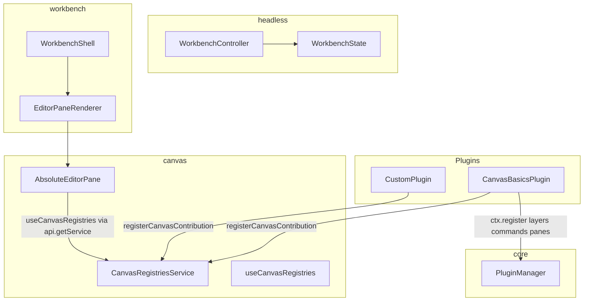
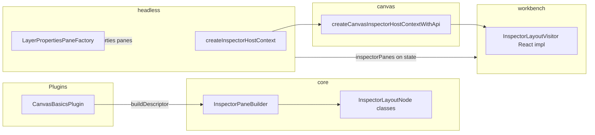

# OpenEnvx Architecture

Package boundaries and contribution flow for the monorepo.

## OSS client tiers

| Tier | Packages | Who |
| --- | --- | --- |
| **Rendering-only** | `schema`, `canvas` | Embed `CanvasEditor` / `CanvasStage` in a custom React app with own state. No plugin host. |
| **Editor backbone** | `core`, `headless`, optional `canvas`, `driver-*`, plugins | Full editor runtime (scene, commands, inspector descriptors) with a **custom UI shell**. See `apps/playground`. |
| **Closed shell** | `workbench` (+ optional closed product packages) | Pre-built chrome. Not OSS. |

**Hard rule:** All canvas code lives in `@xmazu/workbench-canvas`. Not in `core`. Not in `workbench`.

## Package tiers

| Tier | Packages | License (intent) | Responsibility |
| --- | --- | --- | --- |
| Foundation | `schema`, `preview`, `core` | OSS (MIT) | Scene model, generic plugin host, contribution registries for commands/layers/views |
| OSS product | `headless`, `canvas`, `driver-*` | OSS (MIT) | Controller, canvas engine, export drivers |
| Shell | `workbench` | Closed | `WorkbenchShell`, layout chrome, inspector UI, descriptor → component mapping |

## What belongs in `@xmazu/workbench-canvas`

- Konva stage, viewport, geometry, rich-text layout and resize
- `CanvasEditor`, `AbsoluteEditorPane`, TipTap overlay
- Canvas layer definitions, clipboard, canvas commands (`canvas.exportImage`, `canvas.setPagePreset`, …)
- Canvas renderer / preview / interaction contributions, registries, and `Canvas*ServiceId` tokens
- `CanvasRegistriesReader`, `PageResizeService`, `DEFAULT_CANVAS_LAYOUT`
- `useCanvasRegistries()`, `useCanvasApi()` - React hooks for editor panes
- `createCanvasInspectorHostContextWithApi()` - canvas-specific inspector path bindings
- `CanvasBasicsPlugin` - registers layers, renderers, interactions, and the absolute editor pane
- `registerCanvasContribution()` for third-party canvas renderers
- `InspectorPaneContribution` - declarative inspector sections (canvas registers layout/layer/transform panes)

## What belongs in `@xmazu/workbench-core`

- Generic contributions: `Command`, `LayerDefinition`, `View`, `EditorPane`, services
- `Plugin`, `PluginManager`, `registerContribution()`
- **Inspector SDK** - `InspectorPaneBuilder`, layout node classes, `InspectorValuePath`, field kinds (`PropertyBuilder`)
- Generic service ids (`AssetServiceId`, `PersistenceServiceId`, `LocalizationServiceId`) only
- `LocalizationService`, `I18nContribution`, `localize()` - plugin-extensible message bundles and `t()` at descriptor build time
- `InstantiationService` - service registry with `createServiceId` tokens, `registerSingleton`, and constructor `@ServiceId` injection
- **No** canvas types, tokens, or registry contracts
- **No** inspector path resolution for canvas-specific paths (transform, page preset)

## What belongs in `@xmazu/workbench-headless`

- `WorkbenchController`, `WorkbenchState`, `WorkbenchApi` - **canvas-agnostic** editor runtime
- `WorkbenchProvider`, `useWorkbenchContext` (React bridge for OSS editor panes)
- Generic `api.getService(token)` for optional plugin services
- `createInspectorHostContext` - generic paths only (`selection.layer.data.*`, `command.*`)
- `InspectorPathResolver` - maps opaque path strings to read/write handles
- `LayerPropertiesPaneFactory` - synthesizes layer property panes into `inspectorPanes`
- `InspectorPath` - path string helpers for plugin authors

## What belongs in `@xmazu/workbench`

- `WorkbenchShell`, `EditorLayout`, sidebars, top bar, inspector chrome
- `WorkbenchI18nProvider`, `useWorkbenchTranslation()` - `react-i18next` bridge synced to `LocalizationService`
- `EditorPaneRenderer` - mounts registered editor pane components (no canvas logic)
- `PropertyPanelRenderer` + `InspectorContentRenderer` - generic inspector descriptor → field contributions (visitor pattern)
- `DefaultWorkbenchFieldsPlugin` - registers standard field renderers; apps must include it in `plugins` when using `WorkbenchShell`
- `WorkbenchIcon` + `lucide-glyphs.ts` - render-time icon resolution (`IconRegistry` overrides; defaults bundled in workbench)
- `FloatingToolbarRenderer` - renders `ToolbarContribution` descriptors (commands, separators, widgets)
- Optional `createInspectorHostContext` prop - app/canvas layer composes canvas inspector bindings without workbench importing canvas
- `CanvasChrome` - layout slot around the editor area (CSS only)
- **Must not** import `@xmazu/workbench-canvas`

## Contribution flow



1. `CanvasBasicsPlugin.activate()` installs `CanvasRegistriesService` and registers canvas contributions.
2. `CanvasBasicsPlugin` also registers `AbsoluteEditorPaneContribution` via core `EditorPaneContribution`.
3. `WorkbenchController` builds canvas-agnostic `WorkbenchState` (no registry arrays on state).
4. Canvas editor panes resolve registries via `useCanvasRegistries()` → `api.getService(CanvasRegistriesServiceId)`.
5. `WorkbenchShell` renders the matching editor pane component from `state.editorPanes`.

## Composable shell layout

```
WorkbenchShell
├── WorkbenchProvider          ← @xmazu/workbench-headless
├── EditorLayout
│   ├── ActivitySidebar        ← plugin view containers from state
│   ├── CanvasChrome
│   │   ├── EditorPaneRenderer → canvas editor panes
│   │   └── FloatingToolbar
│   └── InspectorPanel
│       └── PropertyPanelRenderer
└── OverlayRenderer / ContextMenuRenderer
```

## Visual design

UI tokens, layout anatomy, and component specs: [packages/workbench/Design.md](packages/workbench/Design.md).

Plugin author API: [apps/docs/extension-guide.md](apps/docs/extension-guide.md).

## Code style - OOP vs functional

| Layer | Style | Examples |
| --- | --- | --- |
| `core`, `headless`, `canvas`, plugins | **OOP** - abstract classes, builders, visitors, resolvers | `Plugin`, `Command`, `LayerDefinition`, `InspectorPaneContribution`, `InspectorPaneBuilder`, `InspectorPathResolver` |
| `workbench` React UI | **Functional only** - function components and hooks; no class components | `PropertyPanelRenderer`, `InspectorContentRenderer`, primitives |

Rules:

- Plugin API surface = **classes extending `Contribution`**, not plain config objects.
- Inspector layout = **class hierarchy + visitor** (`InspectorLayoutNode.accept(visitor)`), not JSON-style unions in core.
- Builders (`PropertyBuilder`, `InspectorPaneBuilder`) = **classes** with fluent methods returning `this`.
- React shell **consumes** OOP descriptors via visitors; it does not define editor-domain pane kinds.

## Inspector flow



1. Plugins subclass `InspectorPaneContribution` and implement `buildDescriptor()` using `createInspectorPane()`.
2. `WorkbenchController` merges plugin panes + synthesized layer property panes into `state.inspectorPanes`.
3. `PropertyPanelRenderer` uses generic `createInspectorHostContext` or a canvas-composed factory passed from the app.
4. Canvas-specific paths (`selection.layer.transform.*`, `scene.activePage.*`) resolve in `@xmazu/workbench-canvas`.
