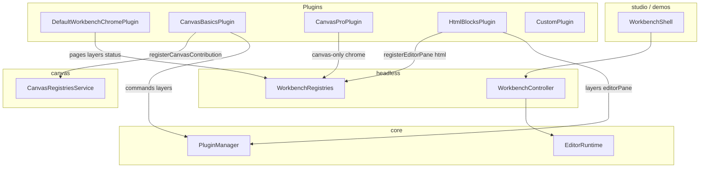

# OpenEnvx Architecture

Package boundaries and contribution flow for the monorepo.

**Audience:** Internal engineers and coding agents. Structure is meant to peel into external docs later without a rewrite.

**Also read:** [Plugin-boundaries.md](Plugin-boundaries.md) — internal vs external plugins, protocol trust boundary, and cloud/marketplace runners. Do not load untrusted plugin JS into the editor main world.

## Deep chapters

| Chapter | Use when |
| --- | --- |
| [Overview](docs/architecture/overview.md) | Mental model, client tiers, how pieces connect |
| [Runtime & core](docs/architecture/runtime-and-core.md) | `EditorRuntime`, `PluginManager`, scene, commands, DI |
| [Workbench & headless](docs/architecture/workbench-and-headless.md) | Controller, UI contributions, layout, property panes |
| [Canvas](docs/architecture/canvas.md) | Engine vs chrome, `CanvasBasicsPlugin` vs canvas-pro |
| [HTML](docs/architecture/html.md) | Block editor, slots, `HtmlBlocksPlugin` |
| [Email driver](docs/architecture/driver-email.md) | React-Email block editor, `EmailBlocksPlugin`, `renderEmailDocument` |
| [Studio & products](docs/architecture/studio-and-products.md) | Fat bundles, what host apps import |
| [Extensions](docs/architecture/extensions.md) | Internal vs embed vs sandbox (summary + links) |
| [Packages & public API](docs/architecture/packages-and-api.md) | Package map, export surface, pre-1.0 stability |

Author how-to:

- Hub (internal vs sandbox vs embed): [apps/docs/README.md](apps/docs/README.md)
- Internal OOP plugins: [apps/docs/extension-guide.md](apps/docs/extension-guide.md)
- Sandbox widgets / plugins + embed: [apps/docs/sandbox-extension-guide.md](apps/docs/sandbox-extension-guide.md)

## Client tiers (monorepo)

| Tier | Packages | Who |
| --- | --- | --- |
| **Rendering-only** | `schema`, `canvas` | Embed `CanvasStage` in a custom React app with own state. No plugin host. |
| **Editor backbone** | `core`, `headless`, optional `canvas` / `html`, `driver-*`, plugins | Full editor runtime (scene, commands, layers) with a **custom UI shell**. See `apps/demo-playground` / `apps/html-demo`. |
| **Workbench UI** | `workbench` | React shell (`WorkbenchShell`); workspace-private. |
| **Published product** | `studio` (+ `schema`, `protocol`, `elements`, `widget-sdk`) | Fat bundle of workbench + canvas + canvas-pro + agent into `dist`; protocol + elements + widget-sdk also published standalone. |
| **HTML studio** | `html`, `html-studio` | Puck-style block editor + thin studio re-exports (workspace-private). |

**Hard rules:** All canvas code lives in `@openenvx/canvas` (not `core`). HTML block editing lives in `@openenvx/html`. Email block editing lives in `@openenvx/driver-email`. Untrusted extension code never runs in the editor main world.

## Package tiers

| Tier | Packages | License / publish (intent) | Responsibility |
| --- | --- | --- | --- |
| Foundation | `schema`, `preview`, `core` | Private (workspace); `schema` also published | Scene model (Zod + JSON Schema), plugin host primitives |
| Embed / sandbox protocol | `protocol` (`@openenvx/protocol`) | Published (public) | `RenderNode`, manifests, validators, sandbox grants, message unions |
| Product libs | `headless`, `canvas`, `html`, `driver-email`, `workbench`, `canvas-pro`, `agent`, `html-studio` | Private (workspace) | Workbench runtime, canvas engine, HTML editor, email driver, React shell, pro chrome, agent |
| Published product | `studio` | Proprietary; published | Fat bundle inlining workbench + canvas + canvas-pro + agent |

## Placement cheat sheet

| Put it here | Examples |
| --- | --- |
| `@openenvx/schema` | Scene Zod schemas, `validateScene` / `normalizeScene`, JSON Schema export |
| `@openenvx/core` | `Command`, `LayerDefinition`, `Plugin`, `EditorRuntime`, `PluginManager`, scene store, `PropertyBuilder`, `Registry` |
| `@openenvx/headless` | `WorkbenchController`, `WorkbenchPlugin`, UI contributions, property host context, external host mount surfaces |
| `@openenvx/canvas` | Konva stage, layers, renderers, `CanvasBasicsPlugin`, `CanvasEditor` |
| `@openenvx/html` | Block configs, `HtmlBlocksPlugin`, `HtmlEditorPane` |
| `@openenvx/driver-email` | Email blocks, `EmailBlocksPlugin`, `EmailEditorPane`, `renderEmailDocument` |
| `@openenvx/workbench` | `WorkbenchShell`, field renderers, sandbox/embed hosts |
| `@openenvx/canvas-pro` | Canvas-only chrome (zoom, transform panes, floating toolbar) |
| `@openenvx/studio` | Product fat bundle + `DEFAULT_STUDIO_PLUGINS` + `createSandboxExtensionHost` |
| `@openenvx/html-studio` | HTML product re-exports + `DEFAULT_HTML_STUDIO_PLUGINS` |
| `@openenvx/protocol` | Embed panel vocabulary for untrusted parents |

## Contribution flow (sketch)

1. `WorkbenchShell` injects default chrome (Pages/Layers + dirty status) plus Inspector / field plugins.
2. Engine plugins (`CanvasBasicsPlugin`, `HtmlBlocksPlugin`, …) register via core + domain registries.
3. Product chrome (`CanvasProPlugin`, …) registers workbench UI only for that editor surface.
4. `WorkbenchController` assembles core + workbench registries into `WorkbenchState`.

External hosts (sandbox / embed) mount **off** `PluginManager` via `ExternalHostMount` — see [Extensions](docs/architecture/extensions.md) and [Plugin-boundaries.md](Plugin-boundaries.md).

## Code style — OOP vs functional

| Layer | Style | Examples |
| --- | --- | --- |
| `core`, `headless`, `canvas`, plugins | **OOP** — abstract classes, builders, visitors | `Plugin`, `Command`, `LayerDefinition`, `PropertyPaneBuilder` |
| App / shell React UI | **Functional only** — function components and hooks | `WorkbenchShell`, field renderers |

Plugin API surface = classes extending contribution base classes, not plain config objects.

## Related

- [Packages & public API](docs/architecture/packages-and-api.md) — exports, who imports what, stability
- [FEATURES.md](FEATURES.md) — product capability matrix
- [PUBLISHING.md](PUBLISHING.md) — what ships to the registry
- [AGENTS.md](AGENTS.md) — agent workflow and placement rules
