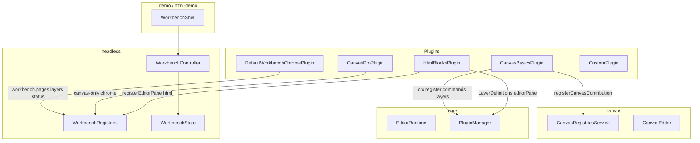
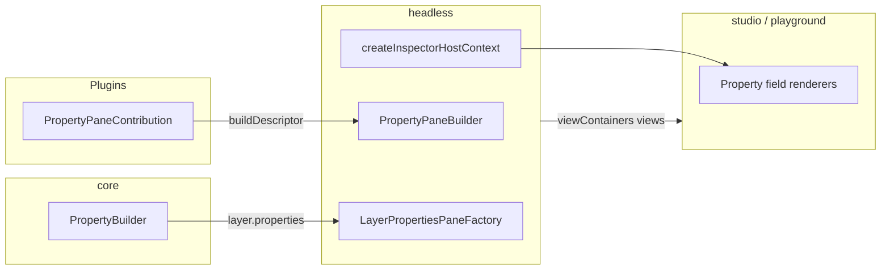

# OpenEnvx Architecture

Package boundaries and contribution flow for the monorepo.

**Also read:** [Plugin-boundaries.md](Plugin-boundaries.md) — internal vs external plugins, protocol trust boundary, and cloud/marketplace runners (iframe / Worker / isolate). Do not load untrusted plugin JS into the editor main world.

## Client tiers (monorepo)

| Tier | Packages | Who |
| --- | --- | --- |
| **Rendering-only** | `schema`, `canvas` | Embed `CanvasStage` in a custom React app with own state. No plugin host. |
| **Editor backbone** | `core`, `headless`, optional `canvas` / `html`, `driver-*`, plugins | Full editor runtime (scene, commands, layers) with a **custom UI shell**. See `apps/demo-playground` / `apps/html-demo`. |
| **Workbench UI** | `workbench` | React shell (`WorkbenchShell`); workspace-private. |
| **Published product** | `studio` (+ `schema`, `plugin-protocol`) | Fat bundle of workbench + canvas + canvas-pro + agent + driver-image into `dist`; protocol also published standalone for embed panel authors. |
| **HTML studio** | `html`, `html-studio` | Puck-style block editor + thin studio re-exports (workspace-private). |

**Hard rule:** All canvas code lives in `@openenvx/canvas`. Not in `core`. HTML block editing lives in `@openenvx/html`.

## `@openenvx/schema` (Scene document)

Canonical **content** Scene JSON is authored once in Zod v4 (`sceneSchemaLenient` / `sceneSchemaCanonical`). Defaults, `validateScene` / `normalizeScene`, and the published `scene.schema.json` (for LLMs and other SDKs) all come from that schema.

`Page.layout` is a **provider-defined string** (e.g. `'absolute'`, `'html'`). Schema normalization is structural only; layout-specific rules (dims, presets, validation) are registered by providers via `PageRulesContribution` in `@openenvx/core`.

| Concept | Role |
| --- | --- |
| `Scene` | Content only: `schemaVersion`, `pages`, optional `assets` / `templatePolicy` |
| `EditorState` | UI state: `activePageId`, `selectedLayerIds`, `primaryLayerId` |
| `SceneSnapshot` | Persisted pair `{ scene, editorState }` |

Built-in layer types (`canvas.rect`, `canvas.image`, `canvas.text`, `canvas.circle`, `canvas.group`) have typed `data`; unknown plugin types use an escape hatch. Import JSON Schema via `@openenvx/schema/scene.schema.json`.

## Package tiers

| Tier | Packages | License / publish (intent) | Responsibility |
| --- | --- | --- | --- |
| Foundation | `schema`, `preview`, `core` | Private (workspace); `schema` also published | Scene model (Zod + JSON Schema), plugin host primitives (commands, layers, page rules, services, property field data) |
| Embed protocol | `plugin-protocol` | Published (public) | Declarative plugin panel JSON tree, `h`/jsx runtime, `postMessage` message unions, `validatePluginTree` caps |
| Product libs | `headless`, `canvas`, `html`, `driver-*`, `workbench`, `canvas-pro`, `agent`, `html-studio` | Private (workspace) | Workbench runtime, canvas engine, HTML block editor, export drivers, React shell, pro chrome, agent |
| Published product | `studio` | Proprietary; published | Fat bundle inlining workbench + canvas + canvas-pro + agent + driver-image |

## What belongs in `@openenvx/canvas`

- Konva stage, viewport, geometry, rich-text layout and resize
- `CanvasEditor`, `CanvasHostProvider`, TipTap overlay
- Canvas layer definitions, clipboard, canvas commands (`canvas.exportImage`, `canvas.setPagePreset`, …)
- Canvas renderer / preview / interaction contributions, registries, and `Canvas*ServiceId` tokens
- `CanvasRegistriesReader`, `PageResizeService`
- `useCanvasRegistries()`, `useCanvasApi()` — require `CanvasHostProvider` (app wires workbench or custom host)
- `CanvasBasicsPlugin` - registers layers, renderers, interactions, and commands only (no workbench chrome)
- `registerCanvasContribution()` for third-party canvas renderers, interactions, and layer preview renderers
- Snap/design-tool overlay behavior is registered separately as a `CanvasStageInteractionService`
- **Per-kind override** — enterprise plugins can replace OSS `canvasLayerRenderers`, `canvasLayerInteractions`, `layerPreviewRenderers`, and driver-image SVG serializers via `{ override: true }`
- **Generic layer handles** — `CanvasLayerInteractionContribution` can provide custom handles (`providesHandles`, `layoutHandles`, `onHandleDrag*`) painted by OSS `CanvasStage`
- **`dataPatch` on `canvas.updateLayerTransform`** — optional enterprise data commits alongside transform updates (`dataPatch` merges into `layer.data`)
- `CanvasStageInteractionService` — optional stage drag/resize adjustment + overlay primitives
- Page size presets (`page-presets.ts`) and `AbsolutePageRules` (`layout: 'absolute'`) — dims defaults, preset inference, width/height validation

**Canvas-only** workbench chrome (zoom/selection status, transform property panes, insert-tool toolbar, grid/rulers) lives in enterprise `@xmazu/openenvxee-canvas-pro`. Scene-generic chrome (Pages/Layers sidebar, dirty status) lives in `@xmazu/openenvxee-workbench` — see below.

## What belongs in `@openenvx/html`

- Puck-style block config registry, block renderers, nested drop zones (dnd-kit)
- Composite blocks via named **`slots`** on `BlockConfig` — real part layers under `data.slots` (not `data.children`), so they stay invisible to the Layers tree and `walkLayers`
- `HtmlEditorPane` registered for `page.layout === 'html'` (preview only; props via shared inspector; slot parts editable inline + via generated inspector fields)
- HTML block commands (`html.insertBlock`, `html.moveBlock`, `html.updateBlockData`, `html.removeBlock`)
- `HtmlBlocksPlugin` — registers `LayerDefinition`s, commands, editor pane, and a primary activity-sidebar **Blocks** panel (`html.blocks`); owns nesting via `data.children` and composites via `data.slots`
- Built-in composites: `html.hero` (slots: headline / body / actions), `html.button`
- No canvas / canvas-pro dependency

## What belongs in `@openenvx/core`

- Plugin host primitives: `Command`, `LayerDefinition`, `Shortcut`, `ContextKey`, `Service`, `I18n`, `PageRulesContribution`
- `Plugin`, `PluginManager`, `EditorRuntime`, `registerContribution()`
- `EditorRuntime` — owns the DI container (`InstantiationService`), core service bootstrap, event bus, context-key contributions, sync, and `createCommandContext()`
- `PluginManager` — plugin lifecycle and contribution routing only; receives `EditorRuntime` via injection
- **Page rules** — providers register `PageRulesContribution` keyed by `page.layout`; `SceneStore` applies them after structural `normalizeScene`
- **Layer property data** — `PropertyBuilder`, `PropertyFieldDescriptor`, `PropertySectionDescriptor` (returned by `LayerDefinition.properties()`)
- Generic service ids (`AssetServiceId`, `PersistenceServiceId`, `LocalizationServiceId`) and editor services (`EditorService`, `DocumentHostService`, `ThemeService`, …)
- `LocalizationService`, `I18nContribution`, `localize()`
- `InstantiationService` - service registry with `createServiceId` tokens
- **Provider/Registry tier** — `Registry<K, V>` keyed runtime registrations (distinct from static contributions and DI services)
- **No** canvas types, tokens, or registry contracts
- **No** workbench UI contribution points (toolbar, palette, views, editor panes, property panes, field renderers)

## What belongs in `@openenvx/headless`

- `WorkbenchController`, `WorkbenchState`, `WorkbenchApi` - workbench runtime; owns `EditorRuntime` and injects it into `PluginManager`
- `bootstrapWorkbenchServices()` - registers headless-specific DI services on an `EditorRuntime`
- `WorkbenchPlugin`, `WorkbenchRegistries`, `WorkbenchPluginContext.registerWorkbench()` - workbench UI contribution registration
- `WorkbenchPluginContext.registerTreeDataProvider()`, `registerFieldRenderer()`, `registerStatusBarItemRenderer()`, `registerEditorPane()` - runtime provider registries
- Workbench contribution points: `Toolbar`, `CommandPalette`, `ViewContainer`, `View`, `ContextMenu`, `StatusBar`, `Overlay`, `PropertyPane`
- Provider registries: `ViewProviderRegistry`, `FieldRendererRegistry`, `StatusBarItemRendererRegistry`, `EditorPaneRegistry`
- Builders: `MenuBuilder`, `ToolbarBuilder`, `CommandPaletteBuilder`, `StatusBarBuilder`, `PropertyPaneBuilder`
- `WorkbenchLayout` (includes independent `activityBar` / `primarySidebar` / `secondarySidebar`), mutable via `WorkbenchApi` / `ShellUiService`
- `WorkbenchLayoutStore` (optional host persistence for visibility + view-container locations)
- `ShellUiService`, `DEFAULT_WORKBENCH_LAYOUT`
- `WorkbenchProvider`, `useWorkbenchContext` (React bridge)
- `createInspectorHostContext`, `InspectorPathResolver`, `LayerPropertiesPaneFactory`, `InspectorPath`

## What belongs in `@xmazu/openenvxee-plugin-protocol`

Declarative plugin UI vocabulary (property panes, chrome menus/toolbar/status/palette), `h`/jsx runtime, `postMessage` message unions (`panel:tree`, `panel:manifest`, `panel:event`, …), and `validatePluginTree` size/type caps. Element trees are plain JSON; they do **not** include React.

Headless mappers (`mapPluginTreeToPropertyPane`, `mapPluginTreeToMenu`, …) live in `@openenvx/headless` and drive the existing fluent builders. Host rendering (`PluginPanel`, `createPostMessagePluginPanelTransport`) lives in `@xmazu/openenvxee-workbench` and renders mapped inspector descriptors through `PropertyContentRenderer`.

Trust model, message allowlists, and cloud/marketplace runners: [Plugin-boundaries.md](Plugin-boundaries.md).

## What belongs in `@xmazu/openenvxee-workbench`

- `WorkbenchShell` — React chrome host; auto-injects default plugins
- `DefaultWorkbenchChromePlugin` — scene-generic `workbench.sidebar` (Pages + Layers), dirty Saved/Unsaved status (`workbench-saved` / `workbench-unsaved`)
- Default inspector container + field renderer plugins
- Shared by canvas studio and HTML studio (no canvas branding on generic chrome)

## Contribution flow



1. `WorkbenchShell` auto-injects `DefaultWorkbenchChromePlugin` (Pages/Layers + dirty status) plus default inspector/fields plugins.
2. `CanvasBasicsPlugin` registers canvas engine contributions via core `ctx.register()` and canvas registries.
3. Enterprise `CanvasProPlugin` registers **canvas-only** workbench chrome (zoom status, transform inspectors, …).
4. `HtmlBlocksPlugin` registers HTML `LayerDefinition`s (inspector props) + `HtmlEditorPane`.
5. `WorkbenchController` assembles core + workbench registries into `WorkbenchState`.

## Workbench layout defaults

`DEFAULT_WORKBENCH_LAYOUT` in `@openenvx/headless` replaces the removed `DEFAULT_CANVAS_LAYOUT` from `@openenvx/canvas`.

| Field | `DEFAULT_WORKBENCH_LAYOUT` | Canvas Pro `DEFAULT_CANVAS_LAYOUT` |
| --- | --- | --- |
| `activityBar` | `true` | `true` |
| `primarySidebar` | `true` | `true` |
| `secondarySidebar` | `true` | `true` |
| `floatingToolbar` | `false` | `true` |
| Other parts | all enabled | all enabled |

Layout visibility is mutable at runtime (`toggleActivityBar` / `togglePrimarySidebar` / `toggleSecondarySidebar`). View containers move between primary and secondary via `api.moveContainer` (panel header menu). Pass optional `layoutStore` (or register `WorkbenchLayoutStoreId`) to persist visibility + locations across reloads.

Set `layout: { floatingToolbar: true }` on `WorkbenchController` when migrating toolbar items that use `when: 'workbench.floatingToolbar'`.

## Composable app layout

```
PlaygroundShell
├── WorkbenchProvider          ← @openenvx/headless
├── EditorPaneHost             ← app-owned: CanvasHostProvider + CanvasEditor
├── PlaygroundToolbar          ← app-owned
└── Inspector / sidebars       ← app-owned React UI
```

Plugin author API: [apps/docs/extension-guide.md](apps/docs/extension-guide.md).

## Code style - OOP vs functional

| Layer | Style | Examples |
| --- | --- | --- |
| `core`, `headless`, `canvas`, plugins | **OOP** - abstract classes, builders, visitors, resolvers | `Plugin`, `Command`, `LayerDefinition`, `PropertyPaneContribution`, `PropertyPaneBuilder`, `InspectorPathResolver` |
| App React UI | **Functional only** - function components and hooks; no class components | `PlaygroundShell`, `EditorPaneHost`, inspector field renderers |

Rules:

- Plugin API surface = **classes extending contribution base classes**, not plain config objects.
- Inspector layout = **class hierarchy + visitor** (`InspectorLayoutNode.accept(visitor)`).
- Layer properties use `PropertyBuilder` in core; workbench pane layout uses `PropertyPaneBuilder` in headless.
- React shell **consumes** OOP descriptors via visitors.

## Property pane flow



1. Plugins subclass `PropertyPaneContribution` (headless) and implement `buildDescriptor()` using `createPropertyPane()`.
2. `LayerDefinition.properties()` returns `PropertySectionDescriptor[]` from core `PropertyBuilder`.
3. `WorkbenchController` merges plugin panes + synthesized layer property panes into `viewContainers` (inspector sidebar) as `content.kind: 'properties'` views.
4. Shell views render panes via `ViewPane` + `PropertyContentRenderer`, using `createInspectorHostContext` from `@openenvx/headless`.
