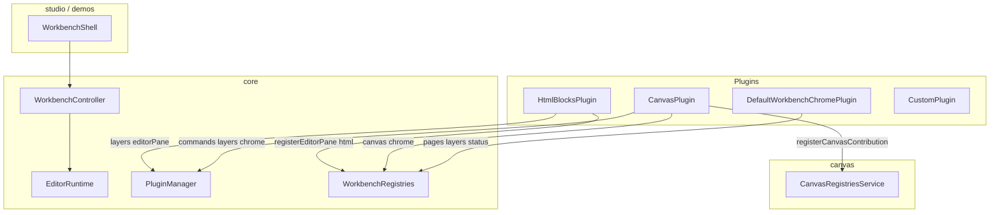

# OpenEnvx Architecture

Package boundaries and contribution flow for the monorepo.

**Audience:** Contributors, integrators, and maintainers. This is the map for understanding package boundaries before changing code.

**Also read:** [Plugin-boundaries.md](Plugin-boundaries.md) - internal vs external plugins, protocol trust boundary, and marketplace runners. Do not load untrusted plugin JS into the editor main world.

## Deep chapters

| Chapter | Use when |
| --- | --- |
| [Overview](docs/architecture/overview.md) | Mental model, client tiers, how pieces connect |
| [Runtime & core](docs/architecture/runtime-and-core.md) | `EditorRuntime`, `PluginManager`, scene, commands, DI |
| [Workbench & headless](docs/architecture/workbench-and-headless.md) | Controller, UI contributions, layout, property panes |
| [Property fields](docs/architecture/property-fields.md) | Inspector field descriptors, kinds, `layout`, `when` |
| [Canvas](docs/architecture/canvas.md) | Canvas engine, `CanvasPlugin`, workbench chrome |
| [HTML](docs/architecture/html.md) | Block editor, slots, `HtmlBlocksPlugin` |
| [HTML editor surfaces](docs/architecture/html-editor-surfaces.md) | Stage / artboard / page-root naming + click selection |
| [Email driver](docs/architecture/email-driver.md) | React-Email block editor, `EmailBlocksPlugin`, `renderEmailDocument` |
| [Studio & products](docs/architecture/studio-and-products.md) | Fat bundles, what host apps import |
| [Extensions](docs/architecture/extensions.md) | Internal vs sandbox (summary + links) |
| [Packages & public API](docs/architecture/packages-and-api.md) | Package map, export surface, pre-1.0 stability |

Author how-to (under `docs/architecture/`):

- [extensions.md](docs/architecture/extensions.md) - lanes overview
- [extensions-sandbox-guide.md](docs/architecture/extensions-sandbox-guide.md) - sandbox widgets / plugins
- [extensions-host-guide.md](docs/architecture/extensions-host-guide.md) - internal OOP plugins
- [roadmap.md](docs/architecture/roadmap.md) - enterprise host API roadmap

## Client tiers (monorepo)

| Tier | Packages | Who |
| --- | --- | --- |
| **Rendering-only** | `schema`, `canvas` | Embed `CanvasStage` in a custom React app with own state. No plugin host. |
| **Editor backbone** | `@openenvx/studio/core`, optional `canvas` / `html`, `driver-*`, plugins | Full editor runtime (scene, commands, layers, workbench controller) with a **custom UI shell**. See `apps/demo-playground` / `apps/html-demo`. |
| **Workbench UI** | `@openenvx/studio` | React shell (`WorkbenchShell`). |
| **Published product** | `studio`, `canvas`, `html`, `email`, `extensions` | Composable editor stack + sandbox author SDK |
| **HTML editor** | `html` (published) | Puck-style block editor; host `@openenvx/studio` + `defaultHtmlWorkbench` |
| **Email editor** | `email` (published, `packages/email-driver`) | React-Email block editor; host `@openenvx/studio` + `defaultEmailWorkbench` |
| **Canvas editor** | `canvas` (published) | Konva canvas editor; host `@openenvx/studio` + `defaultCanvasWorkbench` |

**Hard rules:** All canvas code lives in `@openenvx/canvas-driver` (not `core`). HTML block editing lives in `@openenvx/html-driver`. Email block editing lives in `@openenvx/email-driver`. Untrusted extension code never runs in the editor main world.

## Package tiers

| Tier | Packages | License / publish | Responsibility |
| --- | --- | --- | --- |
| Foundation | `@openenvx/studio` (`/core`, `/schema`, `/preview`) | Published npm, MPL-2.0 | Scene model (Zod + JSON Schema), plugin host primitives |
| Sandbox extensions | `editor-sandbox` (`@openenvx/editor-sandbox`, `./protocol`, `./host`) | Published package, MPL-2.0 | Author SDK, protocol validators, optional QuickJS host runtime |
| Product libs | `variables`, `agent` | Workspace-private | Variables plugin, agent |
| Published product | `@openenvx/studio`, `@openenvx/canvas-driver`, `@openenvx/html-driver`, `@openenvx/email-driver` | Public npm, MPL-2.0 | Composable shell + artboard engines for open-source hosts |

## Placement cheat sheet

| Put it here | Examples |
| --- | --- |
| `@openenvx/studio/core` (`./schema`) | Scene Zod schemas, `validateScene` / `normalizeScene`, JSON Schema export |
| `@openenvx/studio/core` | `Command`, `LayerDefinition`, `Plugin`, `EditorRuntime`, `PluginManager`, scene store, `PropertyBuilder`, `Registry`, `WorkbenchController`, `WorkbenchPlugin`, UI contributions, property host context |
| `@openenvx/canvas-driver` | Konva stage, layers, renderers, `CanvasPlugin`, `CanvasEditor` |
| `@openenvx/html-driver` | Block configs, `HtmlBlocksPlugin`, `HtmlEditorPane` |
| `@openenvx/email-driver` | Email blocks, `EmailBlocksPlugin`, `EmailEditorPane`, `renderEmailDocument`, `renderEmailHtml` |
| `@openenvx/studio/plugins/variables` | Opt-in `VariablesPlugin` (catalog sidebar + `showForm` editor); `./tiptap` chip/suggest helpers |
| `@openenvx/studio` | Published shell (`.`: `WorkbenchShell`, `./theme.css`) + headless subpaths (`/core`, `/schema`, `/preview`, `/react`) |
| `@openenvx/studio/internal` | Workspace-only full shell barrel (primitives, renderers) for monorepo plugins |
| `@openenvx/canvas-driver` | npm: demo surface on `.` + CSS; workspace `.` is full engine (`exportCanvasDocument`, `CanvasPlugin`, …) |
| `@openenvx/html-driver` `.` (npm) | `defaultHtmlWorkbench`, `createHtmlScene` |
| `@openenvx/email-driver` `.` (npm) | `defaultEmailWorkbench`, `createEmailScene`, `renderEmailHtml` |
| `@openenvx/editor-sandbox` | Sandbox author SDK + host (`./protocol`, `./host`, `/canvas`, `/html`, `/panel`, Vite) |

## Contribution flow (sketch)

1. `WorkbenchShell` injects default chrome (Pages/Layers + dirty status) plus Inspector / field plugins.
2. Domain plugins (`CanvasPlugin`, `HtmlBlocksPlugin`, …) register via core + domain registries and workbench contributions.
3. `WorkbenchController` (in `@openenvx/studio/core`) assembles core + workbench registries into `WorkbenchState`.

External hosts (sandbox / embed) mount **off** `PluginManager` via `ExternalHostMount` - see [Extensions](docs/architecture/extensions.md) and [Plugin-boundaries.md](Plugin-boundaries.md).

## Code style - OOP vs functional

| Layer | Style | Examples |
| --- | --- | --- |
| `core`, `canvas`, plugins | **OOP** - abstract classes, builders, visitors | `Plugin`, `Command`, `LayerDefinition`, `PropertyPaneBuilder` |
| App / shell React UI | **Functional only** - function components and hooks | `WorkbenchShell`, field renderers |

Plugin API surface = classes extending contribution base classes, not plain config objects.

## Related

- [Packages & public API](docs/architecture/packages-and-api.md) - exports, who imports what, stability
- [FEATURES.md](FEATURES.md) - product capability matrix
- [PUBLISHING.md](PUBLISHING.md) - what ships to the registry
- [AGENTS.md](AGENTS.md) - agent workflow and placement rules
