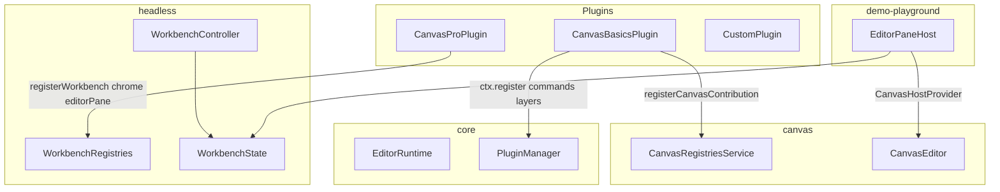
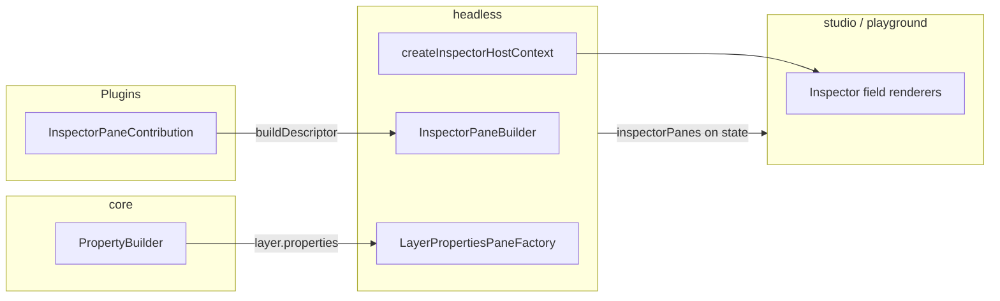

# OpenEnvx Architecture

Package boundaries and contribution flow for the monorepo.

## Client tiers (monorepo)

| Tier | Packages | Who |
| --- | --- | --- |
| **Rendering-only** | `schema`, `canvas` | Embed `CanvasStage` in a custom React app with own state. No plugin host. |
| **Editor backbone** | `core`, `headless`, optional `canvas`, `driver-*`, plugins | Full editor runtime (scene, commands, layers) with a **custom UI shell**. See `apps/demo-playground`. |
| **Published product** | `studio` | Only published package; bundles needed `@openenvx/*` workspace libs into its `dist`. |

**Hard rule:** All canvas code lives in `@openenvx/canvas`. Not in `core`.

## `@openenvx/schema` (Scene document)

Canonical **content** Scene JSON is authored once in Zod v4 (`sceneSchemaLenient` / `sceneSchemaCanonical`). Defaults, `validateScene` / `normalizeScene`, and the published `scene.schema.json` (for LLMs and other SDKs) all come from that schema.

| Concept | Role |
| --- | --- |
| `Scene` | Content only: `schemaVersion`, `pages`, optional `assets` / `templatePolicy` |
| `EditorState` | UI state: `activePageId`, `selectedLayerIds`, `primaryLayerId` |
| `SceneSnapshot` | Persisted pair `{ scene, editorState }` |

Built-in layer types (`canvas.rect`, `canvas.image`, `canvas.text`, `canvas.circle`, `canvas.group`) have typed `data`; unknown plugin types use an escape hatch. Import JSON Schema via `@openenvx/schema/scene.schema.json`.

## Package tiers

| Tier | Packages | License / publish (intent) | Responsibility |
| --- | --- | --- | --- |
| Foundation | `schema`, `preview`, `core` | Private (workspace) | Scene model (Zod + JSON Schema), plugin host primitives (commands, layers, services, property field data) |
| Product libs | `headless`, `canvas`, `driver-*` | Private (workspace) | Workbench runtime, canvas engine, export drivers |
| Published UI | `studio` (+ `canvas-pro` internal) | Proprietary; only `studio` published | React shell renderers; studio bundles inlined `@openenvx/*` deps |

## What belongs in `@openenvx/canvas`

- Konva stage, viewport, geometry, rich-text layout and resize
- `CanvasEditor`, `CanvasHostProvider`, TipTap overlay
- Canvas layer definitions, clipboard, canvas commands (`canvas.exportImage`, `canvas.setPagePreset`, …)
- Canvas renderer / preview / interaction contributions, registries, and `Canvas*ServiceId` tokens
- `CanvasRegistriesReader`, `PageResizeService`
- `useCanvasRegistries()`, `useCanvasApi()` — require `CanvasHostProvider` (app wires workbench or custom host)
- `CanvasBasicsPlugin` - registers layers, renderers, interactions, and commands only (no workbench chrome)
- `registerCanvasContribution()` for third-party canvas renderers, interactions, and layer preview renderers
- Snap/design-tool overlay behavior is registered separately as a `CanvasStageInteractionService`
- **Per-kind override** — enterprise plugins can replace OSS `canvasLayerRenderers`, `canvasLayerInteractions`, `layerPreviewRenderers`, and driver-image SVG serializers via `{ override: true }`
- **Generic layer handles** — `CanvasLayerInteractionContribution` can provide custom handles (`providesHandles`, `layoutHandles`, `onHandleDrag*`) painted by OSS `CanvasStage`
- **`dataPatch` on `canvas.updateLayerTransform`** — optional enterprise data commits alongside transform updates (`dataPatch` merges into `layer.data`)
- `CanvasStageInteractionService` — optional stage drag/resize adjustment + overlay primitives

Workbench chrome for canvas (toolbar, palette, sidebars, editor pane registration) lives in enterprise `@openenvx/canvas-pro`.

## What belongs in `@openenvx/core`

- Plugin host primitives: `Command`, `LayerDefinition`, `Shortcut`, `ContextKey`, `Service`, `I18n`
- `Plugin`, `PluginManager`, `EditorRuntime`, `registerContribution()`
- `EditorRuntime` — owns the DI container (`InstantiationService`), core service bootstrap, event bus, context-key contributions, sync, and `createCommandContext()`
- `PluginManager` — plugin lifecycle and contribution routing only; receives `EditorRuntime` via injection
- **Layer property data** — `PropertyBuilder`, `PropertyFieldDescriptor`, `PropertySectionDescriptor` (returned by `LayerDefinition.properties()`)
- Generic service ids (`AssetServiceId`, `PersistenceServiceId`, `LocalizationServiceId`) and editor services (`EditorService`, `DocumentHostService`, `ThemeService`, …)
- `LocalizationService`, `I18nContribution`, `localize()`
- `InstantiationService` - service registry with `createServiceId` tokens
- **Provider/Registry tier** — `Registry<K, V>` keyed runtime registrations (distinct from static contributions and DI services)
- **No** canvas types, tokens, or registry contracts
- **No** workbench UI contribution points (toolbar, palette, views, editor panes, inspector panes, field renderers)

## What belongs in `@openenvx/headless`

- `WorkbenchController`, `WorkbenchState`, `WorkbenchApi` - workbench runtime; owns `EditorRuntime` and injects it into `PluginManager`
- `bootstrapWorkbenchServices()` - registers headless-specific DI services on an `EditorRuntime`
- `WorkbenchPlugin`, `WorkbenchRegistries`, `WorkbenchPluginContext.registerWorkbench()` - workbench UI contribution registration
- `WorkbenchPluginContext.registerTreeDataProvider()`, `registerFieldRenderer()`, `registerStatusBarItemRenderer()`, `registerEditorPane()` - runtime provider registries
- Workbench contribution points: `Toolbar`, `CommandPalette`, `ViewContainer`, `View`, `ContextMenu`, `StatusBar`, `Overlay`, `InspectorPane`
- Provider registries: `ViewProviderRegistry`, `FieldRendererRegistry`, `StatusBarItemRendererRegistry`, `EditorPaneRegistry`
- Builders: `MenuBuilder`, `ToolbarBuilder`, `CommandPaletteBuilder`, `StatusBarBuilder`, `InspectorPaneBuilder`
- `WorkbenchLayout`, `ShellUiService`, `DEFAULT_WORKBENCH_LAYOUT`
- `WorkbenchProvider`, `useWorkbenchContext` (React bridge)
- `createInspectorHostContext`, `InspectorPathResolver`, `LayerPropertiesPaneFactory`, `InspectorPath`

## Contribution flow



1. `CanvasBasicsPlugin` registers canvas engine contributions via core `ctx.register()` and canvas registries.
2. Enterprise `CanvasProPlugin` registers workbench chrome via `ctx.registerWorkbench()` on a `WorkbenchPlugin`.
3. `WorkbenchController` assembles core + workbench registries into `WorkbenchState`.
4. App shell (`demo-playground`) wires `CanvasHostProvider` + `CanvasEditor`; studio/canvas-pro provide full chrome renderers.

## Workbench layout defaults

`DEFAULT_WORKBENCH_LAYOUT` in `@openenvx/headless` replaces the removed `DEFAULT_CANVAS_LAYOUT` from `@openenvx/canvas`.

| Field | `DEFAULT_WORKBENCH_LAYOUT` | Legacy `DEFAULT_CANVAS_LAYOUT` |
| --- | --- | --- |
| `floatingToolbar` | `false` | `true` |
| Other parts | all enabled | all enabled |

Set `layout: { floatingToolbar: true }` on `WorkbenchController` when migrating toolbar items that use `when: 'workbench.floatingToolbar'`.

## Composable app layout

```
PlaygroundShell
├── WorkbenchProvider          ← @openenvx/headless
├── EditorPaneHost             ← app-owned: CanvasHostProvider + CanvasEditor
├── PlaygroundToolbar          ← app-owned
└── Inspector / sidebars       ← app-owned React UI
```

Plugin author API: [apps/docs/extension-guide.md](apps/docs/extension-guide.md).

## Code style - OOP vs functional

| Layer | Style | Examples |
| --- | --- | --- |
| `core`, `headless`, `canvas`, plugins | **OOP** - abstract classes, builders, visitors, resolvers | `Plugin`, `Command`, `LayerDefinition`, `InspectorPaneContribution`, `InspectorPaneBuilder`, `InspectorPathResolver` |
| App React UI | **Functional only** - function components and hooks; no class components | `PlaygroundShell`, `EditorPaneHost`, inspector field renderers |

Rules:

- Plugin API surface = **classes extending contribution base classes**, not plain config objects.
- Inspector layout = **class hierarchy + visitor** (`InspectorLayoutNode.accept(visitor)`).
- Layer properties use `PropertyBuilder` in core; workbench pane layout uses `InspectorPaneBuilder` in headless.
- React shell **consumes** OOP descriptors via visitors.

## Inspector flow



1. Plugins subclass `InspectorPaneContribution` (headless) and implement `buildDescriptor()` using `createInspectorPane()`.
2. `LayerDefinition.properties()` returns `PropertySectionDescriptor[]` from core `PropertyBuilder`.
3. `WorkbenchController` merges plugin panes + synthesized layer property panes into `state.inspectorPanes`.
4. App inspector UI uses `createInspectorHostContext` from `@openenvx/headless`.
