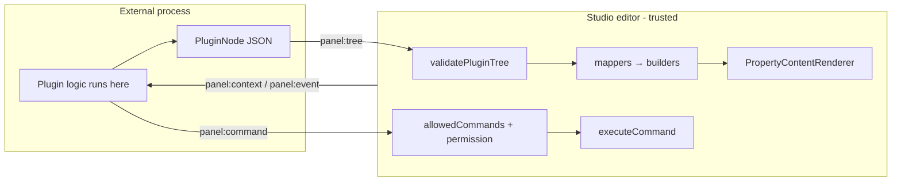
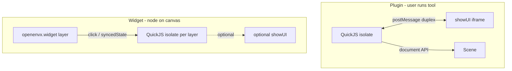
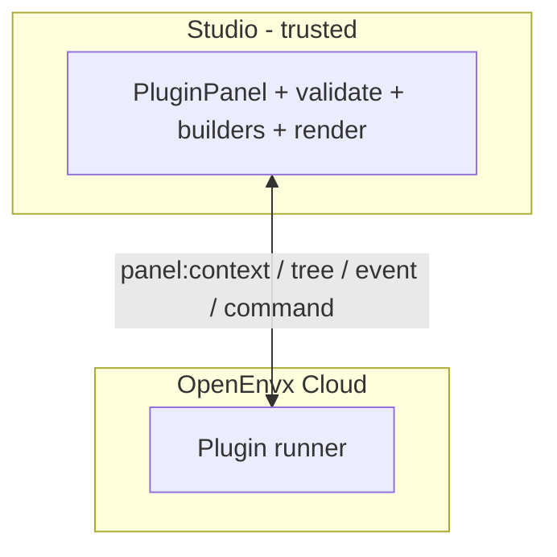

# Plugin trust boundaries

How **internal** (first-party) and **external** (embed / sandbox) extensions relate to the editor. Companion to [Architecture.md](Architecture.md).

## Vocabulary (three ownership trees)

| Term | Meaning | Not |
| --- | --- | --- |
| **Plugin** / **WorkbenchPlugin** | Trusted first-party in-process OOP module on `PluginManager` | Marketplace / untrusted; external hosts |
| **Embed panel** / **`EmbedPanelHost`** | Declarative `panel:*` trees from a parent page; mounted via `mountEmbedPanel` | QuickJS / widgets; `PluginManager` |
| **Sandbox extension** / **`SandboxExtensionHost`** | Untrusted QuickJS grant (Worker isolate); mounted via `mountSandboxExtensions` | Internal OOP; `PluginManager` |
| **Sandbox plugin** (`kind: 'plugin'`) | Off-canvas tool extension | Widget; embed panel |
| **Sandbox widget** (`kind: 'widget'`) | On-canvas `openenvx.widget` + isolate | Sandbox plugin |

**Do not share the PluginManager DI tree with external hosts.** Trusted OOP plugins activate with full `WorkbenchPluginContext` (`services`). Sandbox and embed hosts mount on narrow surfaces (`SandboxHostSurface` / `EmbedPanelHostSurface`) that never expose `InstantiationService`. Untrusted isolates / `panel:*` parents never see either surface.

This is **DI isolation**, not registry isolation: sandbox still registers run commands on the shared `CommandService`, and embed panels still register workbench contributions / view panels / icons so the shell palette and sidebars can render them. `SandboxHostSurface` is privileged for the first-party adapter (scene read/write + `executeCommand`) — isolates never receive it; capability gates stay on the host bridge.

Figma parity (plugins vs widgets, isolate + `showUI` iframe) lives on the **sandbox** path only. Embed panels stay a separate, safer/weaker trust path — do not force them onto QuickJS.

## Hard rule

**Untrusted extension code must never execute inside the Studio / editor main world.**

External embed panels interact only through `@xmazu/openenvxee-plugin-protocol`: serializable UI trees + a small `postMessage` (or equivalent) bus. The host validates data, maps it through the same fluent builders internals use, and renders with Studio’s own React.

Sandbox extensions run in a QuickJS Worker isolate and talk through a capability-gated host bridge; optional UI is a sandboxed iframe (`allow-scripts` only).

This is the VS Code webview / Figma widget model: **UI description + message bus**, not `eval`, dynamic `import()`, or loaded scripts in the host bundle.

## Internal vs external

|  | Internal | External (embed panel) | External (sandbox) |
| --- | --- | --- | --- |
| Runs where | Same JS bundle as the editor | Other document / origin | QuickJS Worker isolate |
| Authors with | OOP `Plugin` + fluent builders | `h` / JSX → JSON tree | JS/TS + `openenvx.*`; optional HTML/`showUI` |
| Trust | First-party | Must not execute arbitrary code in-editor | Must not execute in editor main world |
| Mutation path | Direct `ctx.register` / workbench API | Only `panel:command` through allowlist | Allowlisted `executeCommand` + widget syncedState |
| UI path | Builders → descriptors → renderers | Tree → validate → **same** mappers/builders → renderers | Sandboxed iframe (`showUI`) or on-canvas widget face |

Same renderers underneath for embed panels; different trust boundary. Internal plugins stay privileged in-process OOP. Do not force them onto the protocol vocabulary.

## Plugins vs widgets (Figma-shaped)

Sandbox grants use `kind: 'plugin' | 'widget'` with the same product contract as [Figma’s widgets vs plugins](https://developers.figma.com/docs/widgets/widgets-vs-plugins/):

|  | **Sandbox plugin** | **Sandbox widget** |
| --- | --- | --- |
| Mental model | A **tool you run** | An **object on the canvas** |
| Primary UI | Off-canvas iframe (`showUI`) | On-canvas `openenvx.widget` face; iframe optional |
| Who sees it | Only the user who ran it | Everyone in the file (same layer instance) |
| Lifetime | Starts on user action (`openenvx.sandbox.run.<id>`); one UI modal at a time | Lives while the layer is in the document; one isolate per `extensionId:layerId`; many at once |
| State | `clientStorage` (per-user, session-local today) | `syncedState` on the node (**local until CRDT / multiplayer** — API shape is Figma-like; collaborative sync deferred) |
| Best for | Automation, import/export, setup | Collaborative / on-canvas interaction |

### Authoring / React

| Surface | Supported? | Notes |
| --- | --- | --- |
| React (or any framework) in `showUI` iframe | **Yes** | Authors bundle UI into HTML; host never loads it into Studio’s main React tree. Duplex: `openenvx.ui.postMessage` ↔ iframe `postPluginMessage` / `onPluginMessage`. |
| React in isolate main logic | **No** | QuickJS has no DOM (same as Figma). Plain JS/TS + `openenvx.*`. |
| ReactDOM as widget canvas face | **No** | Would put untrusted UI on the editor render path. |
| Figma-like Widget JSX face | **Deferred** | Isolate returns a declarative tree; host paints. Not a second React runtime. |

**V.1 author promise:** write your panel in React inside `showUI`; talk to the sandbox over `postMessage`. Widget face is host preview + `syncedState` until Widget JSX ships.

## Protocol surface (public for untrusted embed code)

Treat the protocol package as the **only** public extension surface for untrusted **embed panel** authors:

| Direction | Message | Role |
| --- | --- | --- |
| Host → parent | `panel:context` | Selection, permission, theme; optional scene if `contextScope: 'scene'` |
| Host → parent | `panel:event` | Handler id (+ args) for clicks / field writes |
| Parent → host | `panel:tree` | Serializable inspector/chrome tree (root `Pane` for panel body) |
| Parent → host | `panel:command` | Request a host command (allowlisted) |
| Parent → host | `panel:manifest` | Privileged chrome (`allowManifest`); trees validated; commands allowlisted |

Host pieces:

- Transport: `createPostMessagePluginPanelTransport` (origin allowlist required)
- Gate: `canRunPluginPanelCommand` (`permission === 'edit'` ∧ `allowedCommands`)
- Validate: `validatePluginTree` (element whitelist, node/byte caps)
- Map: `mapPluginTreeToPropertyPane`, chrome mappers, `createManifestContributions`
- Render: `PluginPanel` → `PropertyContentRenderer`

### What not to expose to third parties

- Loading external JS modules into Studio
- `registerViewPanel` / `registerFieldRenderer` / `registerEditorPane` for untrusted code
- Binding external trees to internal paths (`selection.layer.*`) without a host-owned write policy
- A “trust all origins” transport in production

## Hardening checklist (stability)

The protocol shape is enough as the **interaction model**. Seal these before treating it as a product boundary:

1. **`panel:manifest` is privileged** — requires `allowManifest: true` on the declaration, `permission === 'edit'`, validated trees, and command ids filtered through `allowedCommands`. Contribute failures are isolated from chrome rebuild.
2. **Default `contextScope` to `selection`** — product default for embeds; `scene` can exfiltrate the full document to the parent and needs explicit host opt-in.
3. **Semantic allowlists** — command ids via `allowedCommands`; external `panel:tree` binds must be `plugin.<panelId>.*` (validated + mapped).
4. **Mandatory origin checks** on the transport.
5. **Capability negotiation** — grow beyond `v: 1` with an explicit capabilities list so the surface can evolve without silent breakage.

Demo: Vite serves [apps/canvas-demo/public/embed-parent.html](apps/canvas-demo/public/embed-parent.html) at `/embed-parent.html`; the iframe loads `/?embed=1` with `EmbedPanelHost` via `WorkbenchShell` `mountExternalHosts` (`contextScope: 'selection'`, empty `allowedCommands`, no manifest).

## QuickJS sandbox (Phase V.1 / V.1.1)

Implemented via `@xmazu/openenvxee-studio` `createSandboxExtensionHost` (workbench `SandboxExtensionHost` + canvas widget click bind), mounted with `mountSandboxExtensions` / `WorkbenchShell` `mountExternalHosts`: **one QuickJS isolate per extension in a dedicated Web Worker** — never silently on the editor UI thread. In-process isolate is test-only (`preferInProcess: true`). Host bridge uses capability + command allowlists; `showUI` is a sandboxed iframe (`allow-scripts` only → opaque origin); `openenvx.widget` canvas nodes carry **local** synced state (collaborative CRDT deferred). Bundles load from session-granted signed URLs + content hashes (minted by openenvx-cloud).

**Plugin lifecycle:** production hosts default `autoStartPlugins: false` — sandbox plugins start via `openenvx.sandbox.run.<id>` (user-run). Demos may opt into auto-start. Closing the UI modal does not stop the isolate; **Stop** / `closePlugin` does.

**OK to run:** cloud-minted, hash-pinned, capability-scoped extensions that you (or a customer org admin) explicitly installed for a session.

**Not OK yet:** open marketplace / “anyone uploads JS and it runs in every Studio” — that needs cloud grant/signing, kill switch, version pinning, and further CPU/UI hardening beyond this boundary. Marketplace distribution remains deferred.

### Isolation caps (V.1.1)

| Cap | Value |
| --- | --- |
| Memory | 8 MiB QuickJS soft limit |
| CPU interrupt | 5s wall-clock per sync eval / pending-jobs burst (`setInterruptHandler`) |
| Worker eval timeout | 15s → terminate Worker |
| Artifact size | 2 MiB; `https:` only (`http:` localhost/127.0.0.1 for tests) |
| Concurrent isolates | 8 |
| `showUI` HTML | 512 KiB |
| UI↔isolate message | JSON-serializable, 64 KiB; duplex `openenvx.ui.postMessage` ↔ iframe `postPluginMessage` / `onPluginMessage`; host pushes `ui:context` (theme always; selection only if grant has `document:read`) |
| `notify` | 500 chars, 10/s per extension → workbench toast overlay |
| Grant ingest | Constructor-only: URL/hash/`uiHtml` size + `normalizeCapabilities` + frozen `allowedCommands` |

UI iframe messages use `postMessage(..., '*')` because the sandboxed frame has an opaque null origin — the host still checks `event.source === iframe.contentWindow`.

See openenvx-cloud `docs/embed/plugin-api.md`.

## Cloud-hosted / marketplace plugins

If OpenEnvx Cloud hosts plugins “added by people,” **only the other endpoint moves**. Studio’s job stays the same: speak the protocol (embed) or mint sandbox grants.

| Where plugin logic runs | When to use |
| --- | --- |
| Customer parent page | Today’s embed |
| Sandboxed iframe on a plugin origin (e.g. `plugins.openenvx.com/<id>/`) | Plugin is a small web UI — simplest for authors |
| Cloudflare Worker (or similar) | Server-side tree generation from events / config |
| QuickJS / Wasm / V8 isolate | Authors upload **raw JS scripts** that must not get DOM/`fetch` by default |

### Isolates (QuickJS and friends)

Use an isolate when you cannot trust a full browser iframe and people upload scripts. Do **not** embed that isolate in the Studio main world.

Rules if you sandbox JS:

- No DOM, no `fetch` by default, no Studio imports
- Only I/O is the host bridge (and optional sandboxed `showUI` iframe)
- Cap CPU (5s interrupt + 15s Worker eval timeout), memory (8 MiB), artifact size, and tree size (tree caps already exist)
- Run in a **Worker** only in production hosts (never `eval` / dynamic `import()` / in-process QuickJS on the editor UI thread). Unit tests may set `preferInProcess: true`.
- Capabilities stay host-side (`allowedCommands`, grant capabilities)

Cloudflare Workers already provide V8 isolates — often enough without shipping QuickJS yourself. QuickJS-in-Wasm is useful when the same tiny sandbox must run in browser _and_ on the server.

Prefer iframe or Worker-without-user-JS first; reach for script isolates only when the authoring model is “upload a script,” not “ship a small app.”

### Marketplace glue (not a new in-editor API)

Install / permissions UI, signed `allowedCommands`, origin allowlists, versioning, kill switch. Avoid: “download plugin bundle and execute inside Studio.”

## Package map

| Concern | Package |
| --- | --- |
| Element vocabulary, `h`/jsx, messages, `validatePluginTree`, sandbox grant types | `@xmazu/openenvxee-plugin-protocol` (published) |
| Tree → builder mappers, plugin host context, manifest → contributions, `ExternalHostMount`, `SandboxHostSurface` / `EmbedPanelHostSurface`, `mountSandboxHost` / `mountEmbedPanelHost` | `@openenvx/headless` |
| `EmbedPanelHost`, `SandboxExtensionHost`, `PluginPanel`, postMessage transport, command gate, sandbox runtime | `@xmazu/openenvxee-workbench` |
| Internal OOP plugins + builders | `@openenvx/core`, `@openenvx/headless`, product plugins (`canvas-pro`, …) |

## Related

- [Architecture.md](Architecture.md) — package boundaries and contribution flow
- [FEATURES.md](FEATURES.md) — embed panels + sandbox extensions rows
- [PUBLISHING.md](PUBLISHING.md) — protocol publish / link notes
