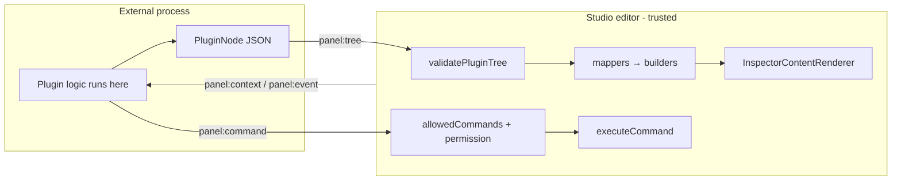
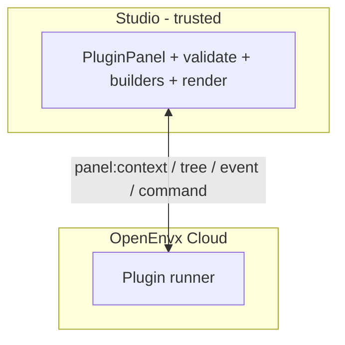

# Plugin trust boundaries

How **internal** (first-party) and **external** (embed / future marketplace) plugins relate to the editor. Companion to [Architecture.md](Architecture.md).

## Hard rule

**Untrusted plugin code must never execute inside the Studio / editor main world.**

External plugins interact only through `@xmazu/openenvxee-plugin-protocol`: serializable UI trees + a small `postMessage` (or equivalent) bus. The host validates data, maps it through the same fluent builders internals use, and renders with Studio’s own React.

This is the VS Code webview / Figma widget model: **UI description + message bus**, not `eval`, dynamic `import()`, or loaded scripts in the host bundle.

## Internal vs external

|  | Internal | External |
| --- | --- | --- |
| Runs where | Same JS bundle as the editor | Other document / origin / Worker |
| Authors with | OOP `Plugin` + fluent builders (`createInspectorPane`, `MenuBuilder`, …) | `h` / JSX → JSON tree (`@xmazu/openenvxee-plugin-protocol`) |
| Trust | First-party | Must not execute arbitrary code in-editor |
| Mutation path | Direct `ctx.register` / workbench API | Only `panel:command` through allowlist |
| UI path | Builders → descriptors → renderers | Tree → validate → **same** mappers/builders → renderers |

Same renderers underneath; different trust boundary. Internal plugins stay privileged in-process OOP. Do not force them onto the protocol vocabulary.

## Protocol surface (public for untrusted code)

Treat the protocol package as the **only** public extension surface for untrusted authors:

| Direction | Message | Role |
| --- | --- | --- |
| Host → parent | `panel:context` | Selection, permission, theme; optional scene if `contextScope: 'scene'` |
| Host → parent | `panel:event` | Handler id (+ args) for clicks / field writes |
| Parent → host | `panel:tree` | Serializable inspector/chrome tree (root `Pane` for panel body) |
| Parent → host | `panel:command` | Request a host command (allowlisted) |
| Parent → host | `panel:manifest` | Privileged chrome (`allowManifest`); trees validated; commands allowlisted |

Host pieces:

- Transport: `createPostMessagePluginPanelTransport` (origin allowlist required)
- Gate: `canRunPluginPanelCommand` (`permission === 'edit'` ∧ `allowedCommands`)
- Validate: `validatePluginTree` (element whitelist, node/byte caps)
- Map: `mapPluginTreeToInspectorPane`, chrome mappers, `createManifestContributions`
- Render: `PluginPanel` → `InspectorContentRenderer`

### What not to expose to third parties

- Loading external JS modules into Studio
- `registerViewPanel` / `registerFieldRenderer` / `registerEditorPane` for untrusted code
- Binding external trees to internal paths (`selection.layer.*`) without a host-owned write policy
- A “trust all origins” transport in production

## Hardening checklist (stability)

The protocol shape is enough as the **interaction model**. Seal these before treating it as a product boundary:

1. **`panel:manifest` is privileged** — requires `allowManifest: true` on the declaration, `permission === 'edit'`, validated trees, and command ids filtered through `allowedCommands`. Contribute failures are isolated from chrome rebuild.
2. **Default `contextScope` to `selection`** — `scene` can exfiltrate the full document to the parent.
3. **Semantic allowlists** — command ids via `allowedCommands`; external `panel:tree` binds must be `plugin.<panelId>.*` (validated + mapped).
4. **Mandatory origin checks** on the transport.
5. **Capability negotiation** — grow beyond `v: 1` with an explicit capabilities list so the surface can evolve without silent breakage.

## Cloud-hosted / marketplace plugins

If OpenEnvx Cloud hosts plugins “added by people,” **only the other endpoint moves**. Studio’s job stays the same: speak the protocol.

| Where plugin logic runs | When to use |
| --- | --- |
| Customer parent page | Today’s embed |
| Sandboxed iframe on a plugin origin (e.g. `plugins.openenvx.com/<id>/`) | Plugin is a small web UI — simplest for authors |
| Cloudflare Worker (or similar) | Server-side tree generation from events / config |
| QuickJS / Wasm / V8 isolate | Authors upload **raw JS scripts** that must not get DOM/`fetch` by default |

### Isolates (QuickJS and friends)

Use an isolate when you cannot trust a full browser iframe and people upload scripts. Do **not** embed that isolate in the Studio main world.

Rules if you sandbox JS:

- No DOM, no `fetch` by default, no Studio imports
- Only I/O is the protocol (context/event in → tree/command out)
- Cap CPU, memory, and tree size (tree caps already exist)
- Run in a **Worker or side iframe**, never `eval` / dynamic `import()` in the editor bundle
- Capabilities stay host-side (`allowedCommands`, `contextScope`, privileged `panel:manifest`)

Cloudflare Workers already provide V8 isolates — often enough without shipping QuickJS yourself. QuickJS-in-Wasm is useful when the same tiny sandbox must run in browser _and_ on the server.

Prefer iframe or Worker-without-user-JS first; reach for script isolates only when the authoring model is “upload a script,” not “ship a small app.”

### Marketplace glue (not a new in-editor API)

Install / permissions UI, signed `allowedCommands`, origin allowlists, versioning, kill switch. Avoid: “download plugin bundle and execute inside Studio.”

## Package map

| Concern | Package |
| --- | --- |
| Element vocabulary, `h`/jsx, messages, `validatePluginTree` | `@xmazu/openenvxee-plugin-protocol` (published) |
| Tree → builder mappers, plugin host context, manifest → contributions | `@openenvx/headless` |
| `PluginPanel`, postMessage transport, command gate | `@xmazu/openenvxee-workbench` |
| Internal OOP plugins + builders | `@openenvx/core`, `@openenvx/headless`, product plugins (`canvas-pro`, …) |

## Related

- [Architecture.md](Architecture.md) — package boundaries and contribution flow
- [FEATURES.md](FEATURES.md) — “Declarative embed plugin panels” capability row
- [PUBLISHING.md](PUBLISHING.md) — protocol publish / link notes
