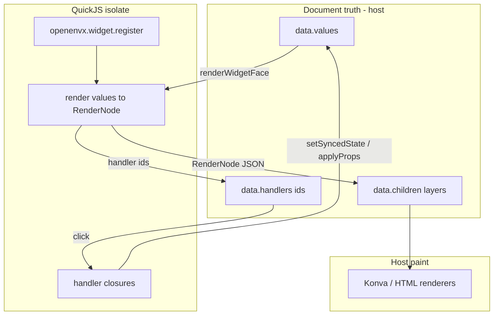
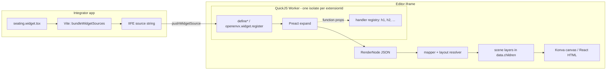
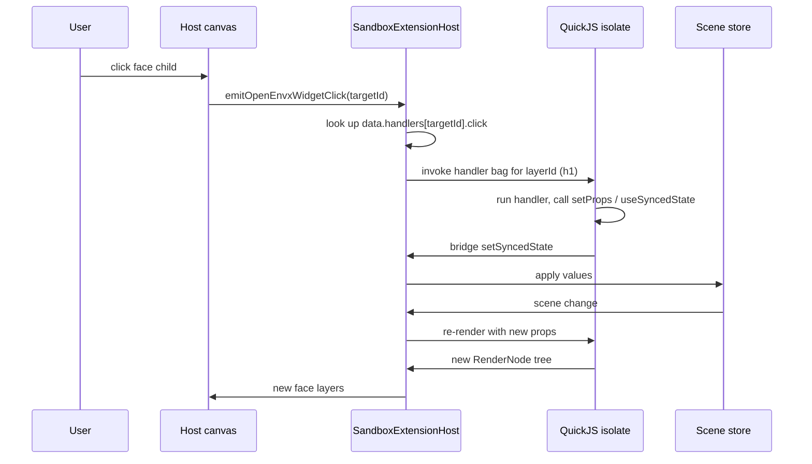
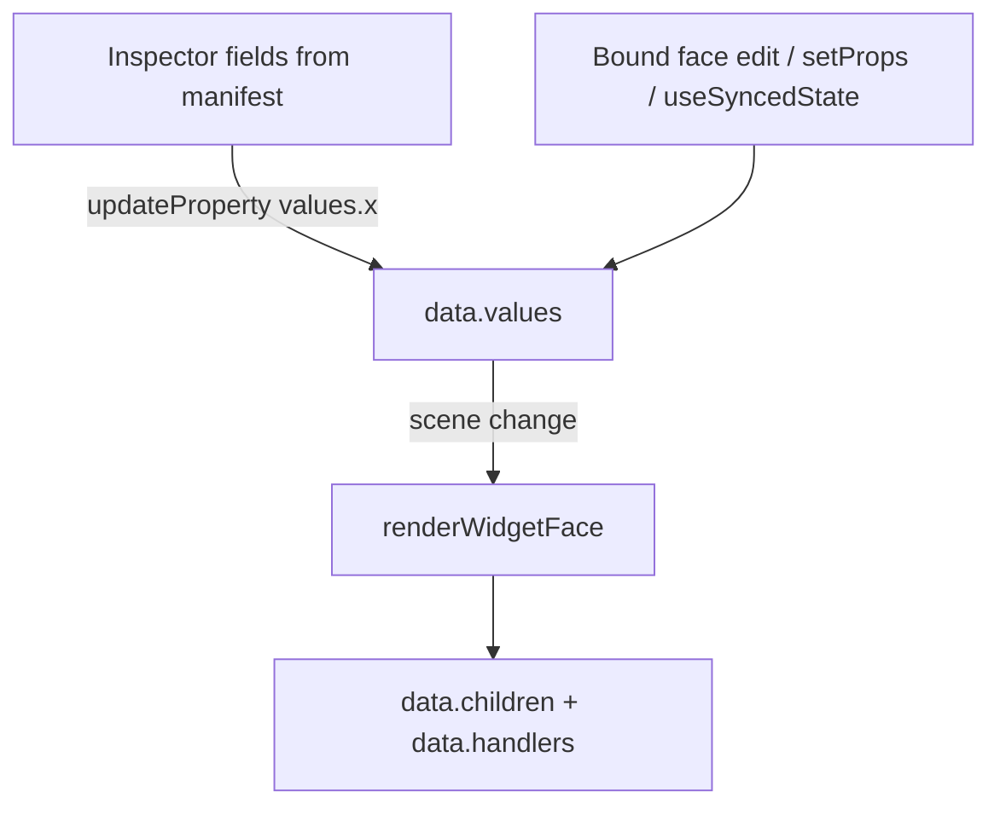

# Widget bridge — outside world to canvas / HTML

**Audience:** Integrators and coding agents. How a developer-authored Preact component becomes pixels (or HTML) inside the hosted editor.

Related: [extensions.md](extensions.md), [Plugin-boundaries.md](../../Plugin-boundaries.md), [packages-and-api.md](packages-and-api.md).

## Who owns what (state vs render)

| Concern | Owner | Notes |
| --- | --- | --- |
| Persistent widget state | **Host document** — `openenvx.widget` layer `data.values` | Survives reload / export; Inspector edits this |
| Face expand (Preact → `RenderNode`) | **QuickJS isolate** | Host calls `renderWidgetFace`; isolate must not own document truth |
| Handler functions | **Isolate** (ephemeral) | Serialized as ids on `data.handlers`; invoked back into QuickJS |
| Map tree → scene layers | **Host** (`applyWidgetFace` / HTML twin) | AutoLayout / flex resolved on host |
| Paint (Konva / HTML) | **Host canvas / HTML engine** | Ordinary layers under `data.children` |
| `openenvx.*` bridge | **Workbench** injects into isolate only | Never available in `showUI` iframe or editor main world |



**Rule:** QuickJS is the **authoring/expand engine**, not the state store. Writing state goes through the bridge (`setSyncedState` / `useSyncedState` / `setProps`) onto the host scene.

## Pipeline



| Package | Role |
| --- | --- |
| `@openenvx/elements` | Preact vocabulary only (`/canvas` `/html` `/panel`) |
| `@openenvx/widget-sdk` | `define*`, props, `renderToElementTree`, Vite packaging, ambient `openenvx` types |
| `@openenvx/workbench` sandbox | Inject `openenvx.*`, capability bridge, `renderWidgetFace` |
| `@xmazu/openenvxee-protocol` | `RenderNode`, manifests, grants |

Demo apps import widgets as `openenvx-widget:./foo.widget.tsx` (IIFE **string**). The host React app never executes the widget; the isolate never sees a browser DOM.

## Events (handler IDs)

Functions never cross the sandbox boundary.



During face expand, `on*` function props become ids (`h1`, …). The host persists `data.handlers` on the widget layer.

## Pure render vs handler pass

| Pass | Allowed |
| --- | --- |
| Face render (`widget.rendering === true`) | Read values; emit `RenderNode`; `setSyncedState` / `applyProps` for prop defaults |
| Handler / state-update | `setProps`, `useSyncedState`, allowlisted `executeCommand`, `showUI` |

`executeCommand` / `showUI` throw if called during face render.

## Props write-back

Persistent state is document props (`data.values`), not Preact `useState`.



`defineCanvasComponent({ props: { title: string() }, render })` compiles schema into `manifest.fields` + `defaults`. Ephemeral Preact hooks die with the isolate.

## Three vocabularies, one envelope

| Subpath | Vocabulary | Maps to |
| --- | --- | --- |
| `@openenvx/elements/canvas` | `Stack`, `Row`, `Grid`, `Rect`, `Text`, … | canvas layers |
| `@openenvx/elements/html` | `Section`, `Row`, `Column`, `Heading`, … | html.* blocks |
| `@openenvx/elements/panel` | `Pane`, `Menu`, `Toolbar`, … | workbench chrome / inspector |

All emit the same `{ type, props, children }` envelope (`RenderNode` in `@xmazu/openenvxee-protocol`). Expand via `@openenvx/widget-sdk` (`renderToElementTree` / `renderPanelTree`). Embed parents may send plain JSON trees without Preact.

## Grants from manifest

`defineExtension` declares `permissions` + optional `requestedCommands` (execute allowlist — not inferred from `contributes.commands`). Host builds the session grant with:

```ts
buildGrantFromManifest({ manifest, session: sessionPolicy, source });
```

Delivery (`source` / artifact) stays host-owned.
