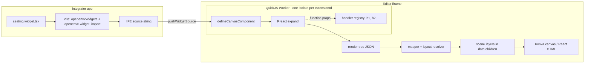
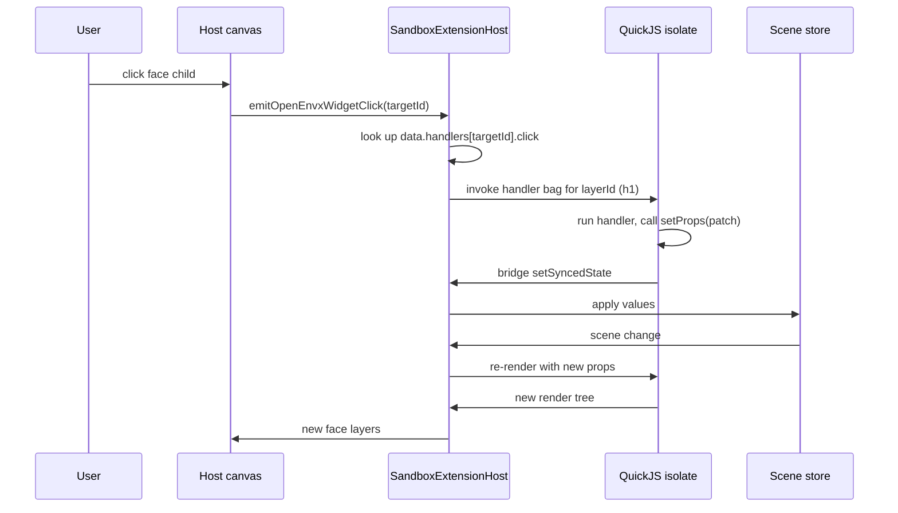
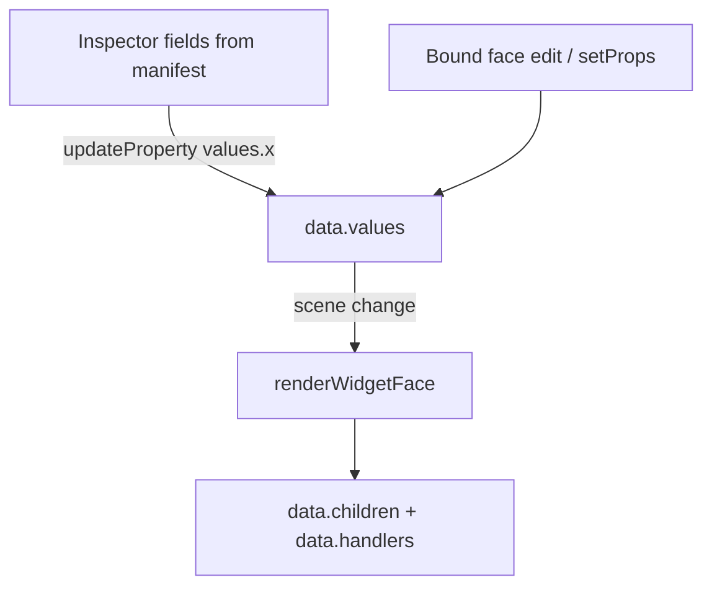

# Widget bridge — outside world to canvas / HTML

**Audience:** Integrators and coding agents. How a developer-authored Preact component becomes pixels (or HTML) inside the hosted editor.

Related: [extensions.md](extensions.md), [Plugin-boundaries.md](../../Plugin-boundaries.md).

## Pipeline

Authoring lives in `@xmazu/openenvxee-elements` (`defineCanvasComponent` / `defineHtmlComponent` / `defineExtension`, prop helpers, canvas/HTML/panel component sets). Demo apps use the Vite plugin `openenvxWidgets()` and import widgets as `openenvx-widget:./foo.widget.tsx` — that returns an IIFE **string** (Preact + elements bundled) which is pushed into the isolate. The host React app never executes the widget; the isolate never sees a browser DOM.

The host maps that tree to ordinary scene layers via `applyWidgetFace` (unwraps a root `canvas.group` into `data.children`, syncs widget width/height to the laid-out face, persists `data.handlers`). Face children are ordinary editable layers under the widget in Layers. Export flattens `children` generically — no isolate on the server.

## Events (handler IDs)

Functions never cross the sandbox boundary.

During render, any `on*` function prop is replaced with an id (`h1`, `h2`, …) and stored in `__openenvxWidgetHandlers`. The face mapper persists `data.handlers` on the widget layer so the host can resolve clicks without holding live function references.

## Props write-back

Persistent state is document props (`data.values`), not Preact `useState`.

`defineCanvasComponent({ props: { title: string() }, render })` compiles the schema into `manifest.fields` + `defaults` for the Inspector. Ephemeral Preact hooks die with the isolate.

## Three vocabularies, one envelope

| Subpath | Vocabulary | Maps to |
| --- | --- | --- |
| `@xmazu/openenvxee-elements/canvas` | `Stack`, `Row`, `Grid`, `Rect`, `Text`, … | canvas layers |
| `@xmazu/openenvxee-elements/html` | `Section`, `Row`, `Column`, `Heading`, … | html.* blocks |
| `@xmazu/openenvxee-elements/panel` | `Pane`, `Menu`, `Toolbar`, … | workbench chrome / inspector |

All emit the same `{ type, props, children }` envelope (`RenderNode` in `@xmazu/openenvxee-protocol`). The protocol package is the wire contract and validator; Preact is the only authoring runtime.

## Interim vs future

Today `@xmazu/openenvxee-protocol` owns the wire contract: `RenderNode`, `ExtensionManifest`, unified messages (`render` / `invoke` / `context` / `command`), validators, and sandbox grants. Authoring lives in `@xmazu/openenvxee-elements` (`defineExtension`, `defineCanvasComponent`, `/canvas` `/html` `/panel`).

**Roadmap:** eventually fold the remaining wire contract into schema / a thinner surface if cloud consumers stop importing the protocol package by name. Tracked on the platform roadmap (M4 / SDK polish).
