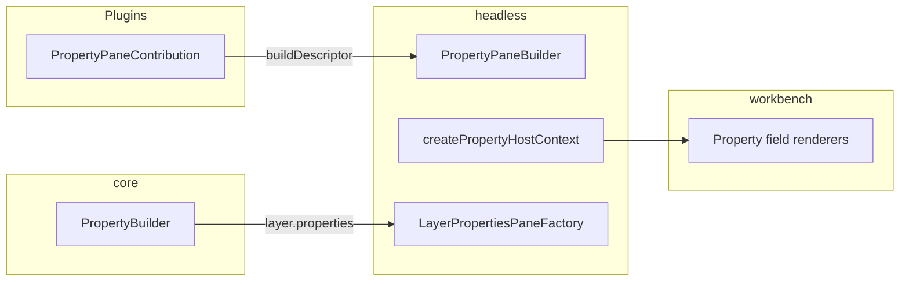

# Workbench & headless

**Audience:** Internal engineers and coding agents. Packages: `@openenvx/headless`, `@openenvx/workbench`.

Hub: [Architecture.md](../../Architecture.md) · Overview: [overview.md](overview.md).

## Split

| Package | Responsibility |
| --- | --- |
| `@openenvx/headless` | Runtime: `WorkbenchController`, state, contributions, builders, property host context, `ExternalHostMount` |
| `@openenvx/workbench` | React shell: `WorkbenchShell`, field/status renderers, default chrome plugins, sandbox/embed host adapters |

Headless is framework UI-agnostic descriptors. Workbench is the first-party React consumer.

## What headless owns

- `WorkbenchController`, `WorkbenchState`, `WorkbenchApi` — owns `EditorRuntime`, injects it into `PluginManager`
- `bootstrapWorkbenchServices()` — headless DI services on the runtime
- `WorkbenchPlugin` + `ctx.registerWorkbench()` — UI contribution registration
- Provider registries: `registerTreeDataProvider`, `registerFieldRenderer`, `registerStatusBarItemRenderer`, `registerEditorPane`
- Contribution points: Toolbar, CommandPalette, ViewContainer, View, ContextMenu, StatusBar, SidebarHeader, Overlay, PropertyPane
- Builders: `MenuBuilder`, `ToolbarBuilder`, `CommandPaletteBuilder`, `StatusBarBuilder`, `SidebarHeaderBuilder`, `PropertyPaneBuilder`
- `WorkbenchLayout` (independent `activityBar` / `primarySidebar` / `secondarySidebar`), `ShellUiService`, `DEFAULT_WORKBENCH_LAYOUT`
- Optional `WorkbenchLayoutStore` for persisted visibility + container locations
- `WorkbenchProvider`, `useWorkbenchContext`
- `createPropertyHostContext`, `PropertyPathResolver`, `LayerPropertiesPaneFactory`, `PropertyPath`
- External hosts (not PluginManager): `ExternalHostMount`, `SandboxHostSurface`, `EmbedPanelHostSurface`, `mountSandboxHost` / `mountEmbedPanelHost`

## What workbench owns

- `WorkbenchShell` — React chrome; auto-injects default plugins; optional `mountExternalHosts` mounts sandbox/embed after start
- `DefaultWorkbenchChromePlugin` — scene-generic Pages + Layers sidebar, dirty Saved/Unsaved status
- Default inspector container + field renderer plugins
- `SandboxExtensionHost` / `mountSandboxExtensions`, `EmbedPanelHost` / `mountEmbedPanel`
- `PluginPanel`, postMessage transport, command gate helpers
- Shared by canvas studio and HTML studio (no canvas branding on generic chrome)

**Host rule:** Product apps declare contributions; the shell renders. Do not mount React panel views from the product host for form/settings panels — use `ViewContribution.buildProperties()` / `emptyMessage` / `when`. Use `registerViewPanel` only for non-form surfaces (chat, version history, …).

## Layout defaults

| Field | `DEFAULT_WORKBENCH_LAYOUT` | Canvas Pro `DEFAULT_CANVAS_LAYOUT` | HTML `DEFAULT_HTML_LAYOUT` |
| --- | --- | --- | --- |
| `activityBar` | `true` | `true` | `true` |
| `primarySidebar` | `true` | `true` | `true` |
| `secondarySidebar` | `true` | `true` | `true` |
| `editorToolbars` | `false` | `true` | `true` |
| Other parts | all enabled | all enabled | all enabled |

Visibility is mutable (`toggleActivityBar` / …). Containers move via `api.moveContainer`. Set `layout: { editorToolbars: true }` (or use `DEFAULT_CANVAS_LAYOUT` / `DEFAULT_HTML_LAYOUT`) to show editor overlay toolbars. Items declare a `placement` (`top-left` | `top-center` | `top-right` | `bottom-left` | `bottom-center` | `bottom-right`) via `ToolbarBuilder.placement(...)`.

**Host rule (toolbars):** Product engines (canvas / html / email) contribute toolbar descriptors only — no React toolbar components in those packages. Workbench `EditorChrome` + `ToolbarRenderer` render shared `IconButton` / `DropdownMenu` chrome.

## Property pane flow



1. Plugins subclass `PropertyPaneContribution` and implement `buildDescriptor()` via `createPropertyPane()`.
2. `LayerDefinition.properties()` returns core `PropertySectionDescriptor[]`.
3. Controller merges plugin panes + synthesized layer panes into inspector views (`content.kind: 'properties'`).
4. Shell renders via `ViewPane` + `PropertyContentRenderer` (shell-internal — hosts must not import these).

Field descriptors, kinds, and `chrome`: [property-fields.md](property-fields.md).

**Naming:** **Inspector** = default secondary container (`workbench.inspector`) hosting canvas/HTML layer property views. Generic form content is a `properties` view + `PropertyPane` / `PropertyPath` in any container.

`PropertyPaneContribution` is for **built-in** workbench plugins (e.g. canvas transform panes) merged into the Inspector — not for embed/dashboard product hosts. Product hosts use `ViewContribution.buildProperties()`.

## External host mount (DI isolation)

Trusted OOP plugins activate on `PluginManager` with full `WorkbenchPluginContext`. Sandbox and embed hosts mount on **narrow surfaces** that never expose `InstantiationService`:

```text
WorkbenchApi.mountSandboxHost / mountEmbedPanelHost
        → ExternalHostMount
        → SandboxHostSurface / EmbedPanelHostSurface
        → workbench SandboxExtensionHost / EmbedPanelHost
```

Isolates / `panel:*` parents never see the surfaces. This is DI isolation, not registry isolation: sandbox may still register run commands; embed may register workbench contributions so the shell can render them. Details: [extensions.md](extensions.md), [Plugin-boundaries.md](../../Plugin-boundaries.md).

## Composable app layout (custom shell)

```text
PlaygroundShell
├── WorkbenchProvider          ← @openenvx/headless
├── EditorPaneHost             ← app-owned: CanvasHostProvider + CanvasEditor
├── PlaygroundToolbar          ← app-owned
└── Inspector / sidebars       ← app-owned React UI
```

Most product apps skip this and use `WorkbenchShell` from studio / html-studio.

## Related

- Visual shell design notes (tokens only): [packages/workbench/Design.md](../../packages/workbench/Design.md)
- Property field API: [property-fields.md](property-fields.md)
- Extension trust: [Plugin-boundaries.md](../../Plugin-boundaries.md)
