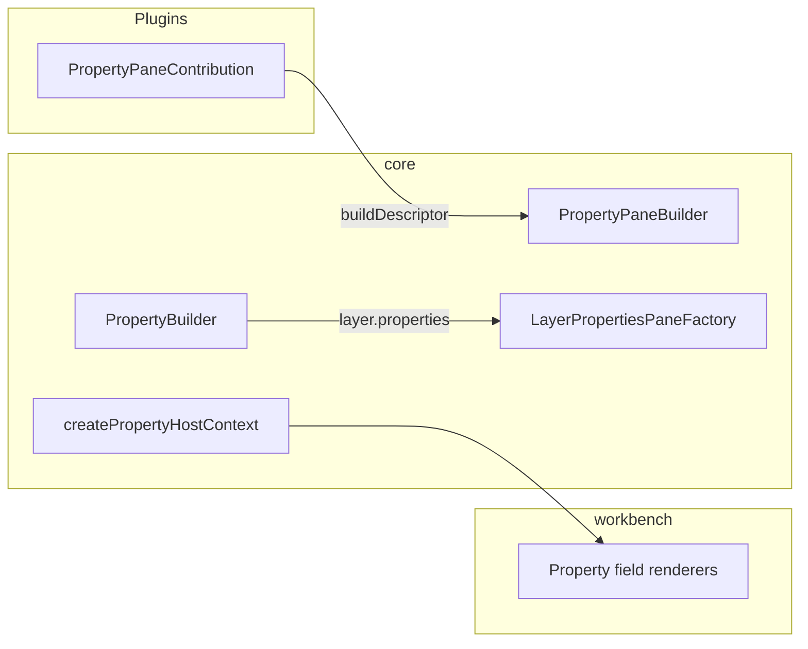

# Workbench & headless

**Audience:** Contributors and integrators. "Headless" is the UI-agnostic controller/contribution layer exported from `@openenvx/studio` (`.`); the React shell is `@openenvx/studio/shell` (workspace monorepo: `@openenvx/studio/internal`).

Hub: [Architecture.md](../../Architecture.md) · Overview: [overview.md](overview.md).

## Split

| Package | Responsibility |
| --- | --- |
| `@openenvx/studio` (headless layer) | Runtime: `WorkbenchController`, state, contributions, builders, property host context, `ExternalHostMount` |
| `@openenvx/studio/shell` | React shell: `WorkbenchShell`, field/status renderers, default chrome plugins, sandbox/embed host adapters |

The headless layer is framework UI-agnostic descriptors, shipped from `@openenvx/studio` (`.` and `./react`). Workbench is the first-party React consumer.

## What the headless layer (in `@openenvx/studio`) owns

- `WorkbenchController`, `WorkbenchState`, `WorkbenchApi` - owns `EditorRuntime`, injects it into `PluginManager`
- `bootstrapWorkbenchServices()` - headless DI services on the runtime
- `WorkbenchPlugin` + `ctx.registerWorkbench()` - UI contribution registration
- Provider registries: `registerTreeDataProvider`, `registerFieldRenderer`, `registerStatusBarItemRenderer`, `registerEditorPane`, `registerViewPanel`
- View content kinds: `tree` (explorer), `list` (flat catalogs with row actions + optional reorder), `properties` (inspector forms), `component` (custom React panels), `welcome` (empty state)
- Contribution points: Toolbar, CommandPalette, ViewContainer, View, ContextMenu, StatusBar, SidebarHeader, Overlay, PropertyPane, TopBar
- Builders: `MenuBuilder`, `ToolbarBuilder`, `TopBarBuilder`, `CommandPaletteBuilder`, `StatusBarBuilder`, `SidebarHeaderBuilder`, `PropertyPaneBuilder`
- `WorkbenchLayout` (independent `activityBar` / `primarySidebar` / `secondarySidebar`), `ShellUiService`, `DEFAULT_WORKBENCH_LAYOUT`
- Optional `WorkbenchLayoutStore` for persisted visibility + container locations
- `WorkbenchProvider`, `useWorkbenchContext` (from `@openenvx/studio/react`)
- `createPropertyHostContext`, `PropertyPathResolver`, `LayerPropertiesPaneFactory`, `PropertyPath`
- External hosts (not PluginManager): `ExternalHostMount`, `SandboxHostSurface`, `EmbedPanelHostSurface`, `mountSandboxHost` / `mountEmbedPanelHost`

## What workbench owns

- **WorkbenchShell** - React chrome; resolves default plugins via `resolveWorkbenchPlugins()` (ordered catalog in `packages/studio/src/plugins/resolve-workbench-plugins.ts`); optional `onSceneChange` for content persistence; optional `mountExternalHosts` mounts sandbox/embed after start
- `DefaultWorkbenchChromePlugin` - scene-generic Pages + Layers sidebar, dirty Saved/Unsaved status
- Default inspector container + field renderer plugins
- `SandboxExtensionHost` / `mountSandboxExtensions`, `EmbedPanelHost` / `mountEmbedPanel`
- `PluginPanel`, postMessage transport, command gate helpers
- Shared by canvas studio and HTML studio (no canvas branding on generic chrome)

**Host rule:** Product apps declare contributions; the shell renders. Do not mount React panel views from the product host for form/settings panels - use `ViewContribution.buildProperties()` / `emptyMessage` / `when`. Use `registerViewPanel` only for non-form surfaces (chat, version history, …).

**View resolve order** (per `ViewContribution`): `buildProperties` → `componentId` → registered `TreeDataProvider` (`presentation: 'list' | 'tree'`, default `tree`) → `emptyMessage` welcome when no provider → empty tree.

**List views** - declare `presentation: 'list'` on the view and register a `TreeDataProvider`. Optional `addCommandId` / `addLabel` render a footer add button; `TreeItem.actions` render per-row icon buttons. Reorder uses the same `handleMove` / `canMove` hooks as explorer trees.

**Dialogs** - same host rule as sidebars: declare intent via headless APIs; the shell renders. `WorkbenchShell` mounts a single `DialogHost` (no per-feature `*DialogHost` in product hosts). One active dialog at a time — a new `showConfirm` / `showForm` replaces the current.

| API | Use |
| --- | --- |
| `api.showConfirm({ title, description, confirmLabel?, cancelLabel? })` | `Promise<boolean>` — cancel / backdrop / Escape → `false` |
| `api.showForm({ title, nodes, values, submitLabel?, cancelLabel?, extraActions?, validate? })` | `Promise<FormDialogResult \| undefined>` — `nodes` from `createPropertyPane(...).build().nodes` (same field kinds as the inspector); cancel → `undefined` |
| `DialogService` | Same methods on `ctx.services.get(DialogServiceId)` inside commands |

Shell-internal (React only): `api.resolveDialogConfirm(confirmed)`, `api.resolveDialogForm(result)`, `api.patchDialogFormPayload(patch)`. `extraActions` may include nested `confirm` options; the form renderer shows a local confirm overlay without stacking `DialogService` entries. Only the **first** `extraActions` entry is rendered (left footer). `validate` runs on **submit** only, not on extra actions. Form fields use the same `PropertyPath.layerData` paths as the inspector; `command.*` paths and scene-only `when` keys are not supported in form dialogs.

```ts
import { DialogServiceId } from '@openenvx/studio';

const ok = await api.showConfirm({
  title: 'Delete?',
  description: 'Cannot undo.',
});

const result = await ctx.services.get(DialogServiceId)?.showForm({
  title: 'Create variable',
  nodes: createPropertyPane('variables.edit', 'Variable')
    .row(
      'Key',
      { key: 'key', kind: 'text', label: 'Key' },
      PropertyPath.layerData('key')
    )
    .build().nodes,
  values: { key: 'name', sample: '' },
  validate: (values) => (values.key ? null : 'Key required'),
});
if (result?.action === 'submit') {
  // apply values
}
```

## Layout defaults

| Field | `DEFAULT_WORKBENCH_LAYOUT` | Canvas Pro `DEFAULT_CANVAS_LAYOUT` | HTML `DEFAULT_HTML_LAYOUT` | Email `DEFAULT_EMAIL_LAYOUT` |
| --- | --- | --- | --- | --- |
| `activityBar` | `true` | `true` | `true` | `true` |
| `primarySidebar` | `true` | `true` | `true` | `true` |
| `secondarySidebar` | `true` | `true` | `true` | `true` |
| `editorToolbars` | `false` | `true` | `true` | `false` |
| `topBar` | `false` | `true` | `false` | `true` |
| Other parts | all enabled | all enabled | all enabled | all enabled |

Visibility is mutable (`toggleActivityBar` / …). Containers move via `api.moveContainer`. Set `layout: { editorToolbars: true }` (or use `DEFAULT_CANVAS_LAYOUT` / `DEFAULT_HTML_LAYOUT`) to show editor overlay toolbars. Items declare a `placement` (`top-left` | `top-center` | `top-right` | `bottom-left` | `bottom-center` | `bottom-right`) via `ToolbarBuilder.placement(...)`. Set `layout: { topBar: true }` (or use `DEFAULT_CANVAS_LAYOUT` / `DEFAULT_EMAIL_LAYOUT`) to show the optional shell header; domain plugins **always** contribute items via `TopBarContribution` + `TopBarBuilder` (`left` | `center` | `right` placements) — never gate registration behind plugin constructor flags. Workbench `TopBarRenderer` renders the merged descriptors when `layout.topBar` is true. No contribution = no header.

**Host rule (toolbars):** Product engines (canvas / html / email) contribute toolbar and top-bar descriptors only - no React toolbar/top-bar components in those packages. Workbench `EditorChrome` + `ToolbarRenderer` / `TopBarRenderer` render shared button and dropdown chrome. HTML preview overlay toolbars use `when: '!workbench.topBar'` so device/zoom chrome hides when the layout header is on.

## Property pane flow



1. Plugins subclass `PropertyPaneContribution` and implement `buildDescriptor()` via `createPropertyPane()`.
2. `LayerDefinition.properties()` returns core `PropertySectionDescriptor[]`.
3. Controller merges plugin panes + synthesized layer panes into inspector views (`content.kind: 'properties'`).
4. Shell renders via `ViewPane` + `PropertyContentRenderer` (shell-internal - hosts must not import these).

Field descriptors, kinds, and `layout`: [property-fields.md](property-fields.md) (including layout-node `when` for conditional rows/blocks).

**Editor diagnostics:** global debug flag (`openenvx:debug`, `WorkbenchControllerOptions.debug`, `api.setEditorDebug`) drives `[OpenEnvx]` console groups (e.g. `property.when` token resolution, `property.field` descriptor validation). See [property-fields.md](property-fields.md#diagnostics-global-editor-debug).

**Naming:** **Inspector** = default secondary container (`workbench.inspector`) hosting canvas/HTML layer property views. Generic form content is a `properties` view + `PropertyPane` / `PropertyPath` in any container.

`PropertyPaneContribution` is for **built-in** workbench plugins (e.g. canvas transform panes) merged into the Inspector - not for embed/dashboard product hosts. Product hosts use `ViewContribution.buildProperties()`.

## External host mount (DI isolation)

Trusted OOP plugins activate on `PluginManager` with full `WorkbenchPluginContext`. Sandbox and embed hosts mount on **narrow surfaces** that never expose `InstantiationService`:

```text
WorkbenchApi.mountSandboxHost / mountEmbedPanelHost
        → ExternalHostMount
        → SandboxHostSurface / EmbedPanelHostSurface
        → workbench SandboxExtensionHost / EmbedPanelHost
```

Isolates / `panel:*` parents never see the surfaces. This is DI isolation, not registry isolation: sandbox may still register run commands; embed may register workbench contributions so the shell can render them. Details: [extensions.md](extensions.md), [Plugin-boundaries.md](../../Plugin-boundaries.md).

## Composable app layout (custom shell)

```text
PlaygroundShell
├── WorkbenchProvider          ← @openenvx/studio/react
├── EditorPaneHost             ← app-owned: CanvasHostProvider + CanvasEditor
├── PlaygroundToolbar          ← app-owned
└── Inspector / sidebars       ← app-owned React UI
```

Most product apps skip this and use `WorkbenchShell` from `@openenvx/studio` or a driver `./studio` preset.

## Related

- Visual shell design notes (tokens, Base UI primitives, Tabler icons): [packages/studio/Design.md](../../packages/studio/Design.md)
- Property field API: [property-fields.md](property-fields.md)
- Extension trust: [Plugin-boundaries.md](../../Plugin-boundaries.md)
